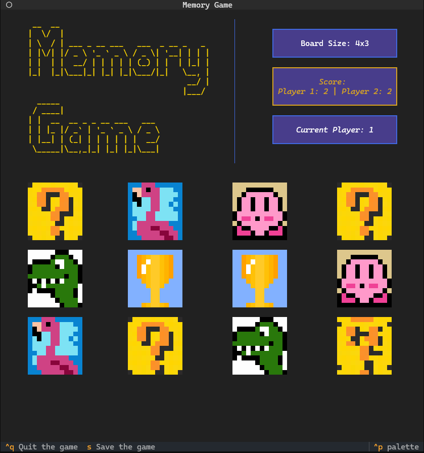
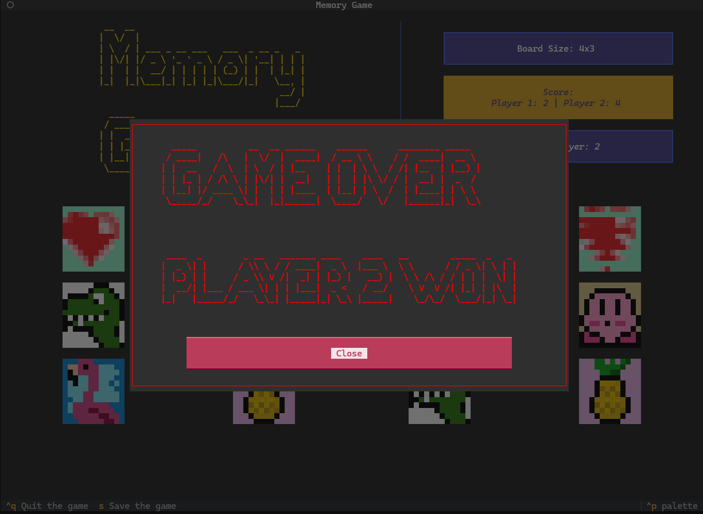
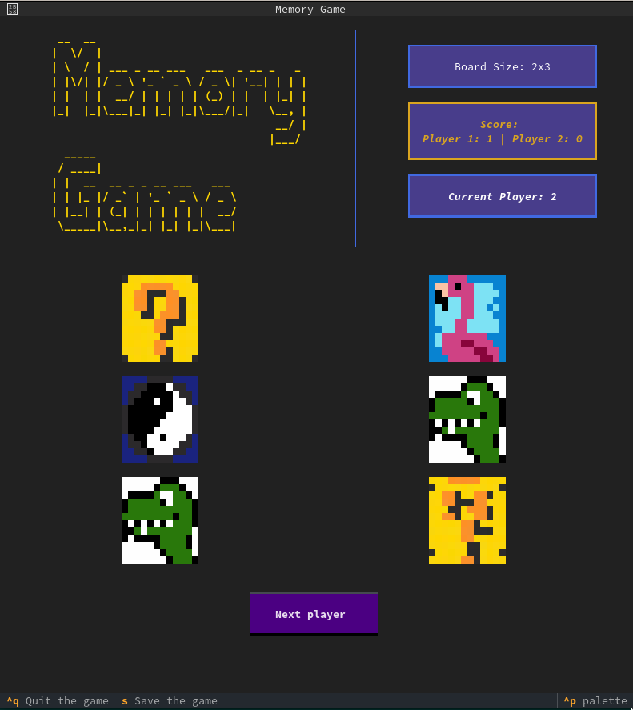
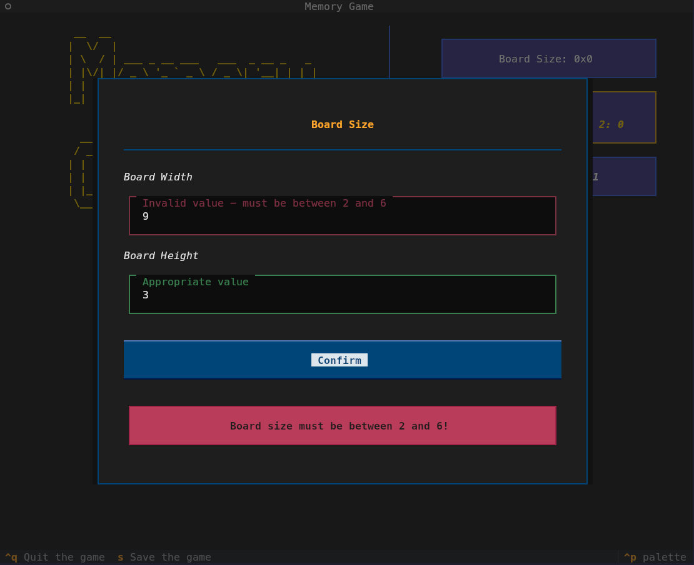
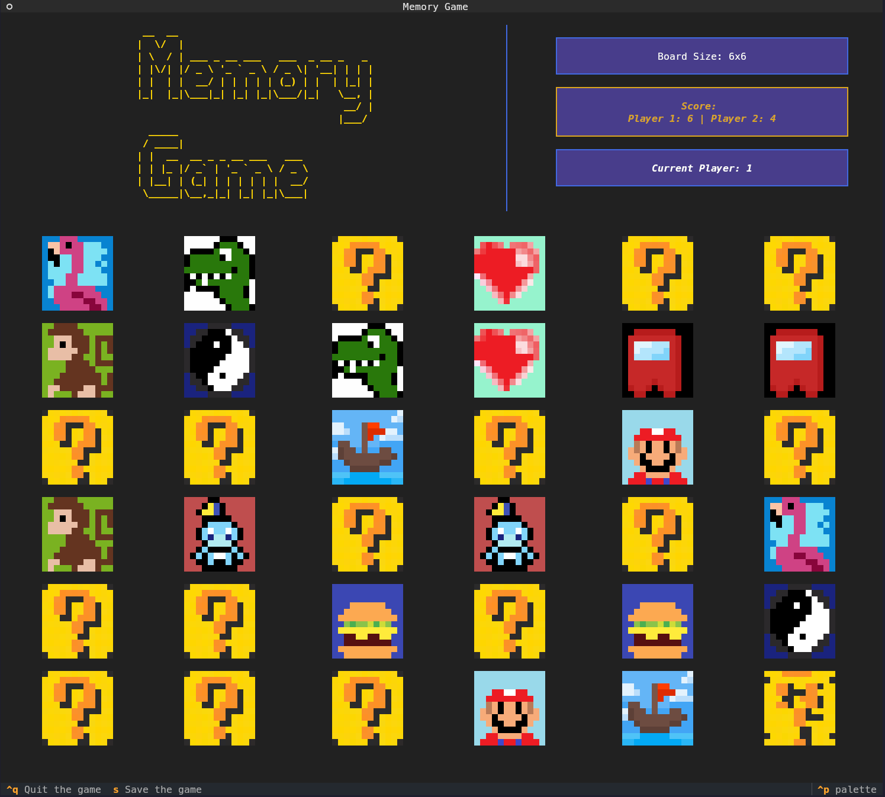

[](./README.md)
[](./README-PL.md)

# Memory Game

## Spis treści

- [Opis gry](#opis-gry)
- [Zrzuty ekranu](#zrzuty-ekranu)
- [Instalacja](#instalacja)
  - [Windows](#windows)
  - [Linux](#linux)
- [Instrukcja dla gracza](#instrukcja-dla-gracza)
- [Główne funkcjonalności](#główne-funkcjonalności)
- [Konfiguracja](#konfiguracja)

## Opis gry

Memory Game to klasyczna gra pamięciowa zaimplementowana jako aplikacja konsolowa dla dwóch graczy. Gracze na zmianę odkrywają po dwie karty, starając się odnaleźć pary identycznych symboli. Gracz, który znajdzie parę, może wykonać kolejny ruch. Wygrywa osoba, która zbierze najwięcej par.

Gra została stworzona z wykorzystaniem nowoczesnych bibliotek Pythona, zapewniających przyjemny interfejs użytkownika mimo konsolowego charakteru aplikacji.

## Zrzuty ekranu

### Windows terminal




### Linux terminals

- _Gnome terminal_



- _Kitty terminal_




## Instalacja

### Wymagania systemowe

- Python 3.8 lub nowszy
- Pip (menedżer pakietów Pythona)

### Windows

1. Instalacja Pythona:
   - Pobierz i zainstaluj Python 3.8 lub nowszy ze strony [python.org](https://python.org)
   - Podczas instalacji zaznacz opcję "Add Python to environment variables"
2. Otwórz wiersz poleceń (cmd) jako administrator
3. Sklonuj repozytorium i przejdź do katalogu projektu:

```cmd
git clone <adres-repozytorium>
cd memory-game
```

4. Stwórz i aktywuj wirtualne środowisko:

```cmd
python -m venv venv
venv\Scripts\activate
```

5. Zainstaluj grę:

```cmd
pip install -e .
```

### Linux

1. Zainstaluj Pythona (jeśli nie jest zainstalowany):

- _Debian based distributions_ (na innych dystrybucjach należy użyć innego systemu zarządzania pakietami i odpowiadających pakietów)

```bash
sudo apt-get update
sudo apt-get install python3 python3-pip python3-venv git
```

2. Sklonuj repozytorium i przejdź do katalogu projektu:

```bash
git clone <adres-repozytorium>
cd memory-game
```

3. Stwórz i aktywuj wirtualne środowisko:

```bash
python3 -m venv venv
source venv/bin/activate
```

4. Zainstaluj grę:

```bash
pip install -e .
```

## Instrukcja dla gracza

### Uruchomienie gry

Po instalacji możesz uruchomić grę na jeden z następujących sposobów:

1. Jeśli zainstalowano używając requirements.txt:

```bash
python main.py -c config/default.ini
# lub
python -m src.memory_game.app -c config/default.ini
# lub
memory-game -c config/default.ini
```

- Aby zobaczyć możliwe parametry przy uruchamianiu:

```bash
python main.py --help
# lub
memory-game --help
```

### Rozgrywka

1. Gra rozpoczyna się od wyboru rozmiaru planszy (max. 6x6)
2. Po wyborze wymiarów pojawi się plansza z zakrytymi kartami
3. Gracze na zmianę wybierają po dwie karty
4. Jeśli karty tworzą parę:
   - Gracz zdobywa punkt
   - Karty pozostają odkryte
   - Gracz może wykonać kolejny ruch
5. Jeśli karty są różne:
   - Karty zostają zakryte
   - Kolejka przechodzi na drugiego gracza
6. Gra kończy się, gdy wszystkie pary zostaną odnalezione

### Dodatkowe informacje

- Aby wyjść z gry należy użyć skrótu klawiszowego `ctrl+q`
- Aby zapisać stan gry należy użyć klawisza `s`
- Wczytywanie stanu gry jest wykonywane za pomocą pliku konfiguracyjnego opisanego w dalszej części
- `ctrl+p` wyświetli możliwe do wykonania akcje
- Za pomocą klawisza `Tab` można poruszać się po planszy i przyciskach
- W przypadku jakichkolwiek błędów proszę przejrzeć plik: `memory_game.log` znajdujący się w katalogu, z którego zostaje uruchomiona gra

## Główne funkcjonalności

- Konfigurowalna wielkość planszy
- System zapisu i wczytywania stanu gry
- Szyfrowanie zapisanych stanów gry
- Intuicyjny interfejs użytkownika w konsoli
- Kolorowe oznaczenia i symbole kart
- Licznik punktów dla obu graczy
- Możliwość konfiguracji poprzez plik INI

## Konfiguracja

Gra może być konfigurowana poprzez plik INI zawierający następujące sekcje:

### [BOARD]

- `width` - szerokość planszy (liczba kart)
- `height` - wysokość planszy (liczba kart)

### [SAVE_GAME]

- `game_save_file` - ścieżka do pliku, do którego zostanie zapisany stan gry po wciśnięciu klawisza "s"
- `key_save_file` - ścieżka do pliku, w którym zostanie zapisany klucz szyfrowania

> [!NOTE]
> Zawartość pliku `game_save_file` zostanie całkowicie zastąpiona przy zapisywaniu stanu gry.

> [!TIP]
> Domyślnie stan gry zostanie zapisany w katalogu, z którego zostaje uruchumiana gra w plikach game_save.dat i save.key.

### [LOAD_GAME]

- `game_load_file` - ścieżka do pliku z zapisanym stanem gry
- `key_load_file` - ścieżka do pliku z kluczem szyfrowania pozwalającym na odczytanie stanu gry
- `load` - flaga określająca czy wczytać zapisaną grę (true/false)

> [!NOTE]
> Ścieżki w pliku konfiguracyjnym mogą być względne (początkowym katalogiem będzie miejsce uruchomienia gry - _current working directory_) lub absolutne.

> [!TIP]
> Jeżeli load jest ustawione na true, stan gry zostanie wczytany domyślnie z plików game_save.dat i save.key w katalogu uruchomienia gry. Wczytanie stanu gry jest wykonywane automatycznie przy uruchamianiu.

Przykładowy plik `default.ini`:

```ini
[BOARD]
width = 2
height = 3

[SAVE_GAME]
game_save_file = /home/user/Documents/game_save.dat
key_save_file = /home/user/Documents/save.key

[LOAD_GAME]
game_load_file = /home/user/Documents/game_save.dat
key_load_file = /home/user/Documents/save.key
load = true
```
